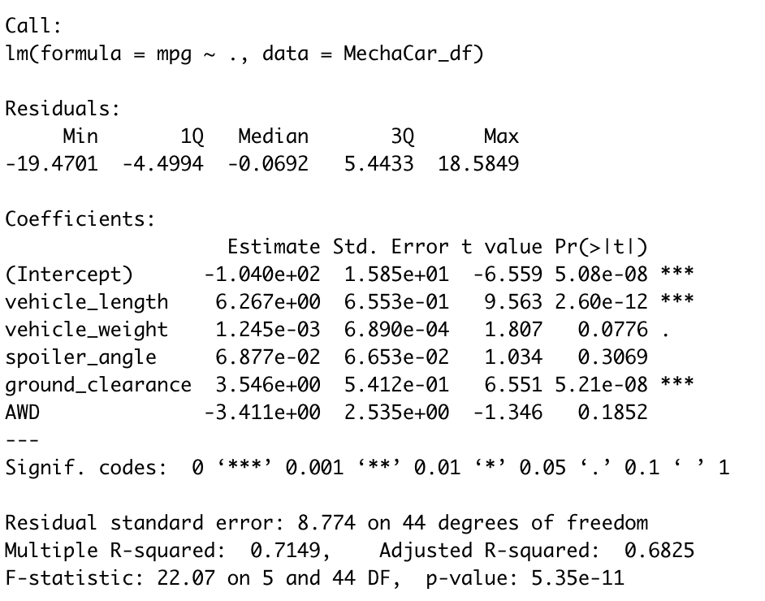
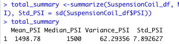
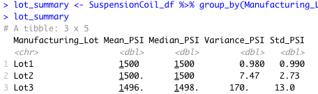
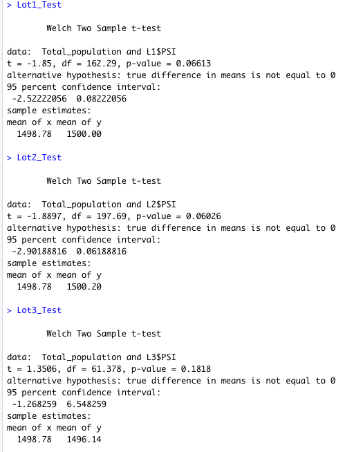

# MechaCar_Statistical_Analysis
Author: Jerome Simmons

## Linear Regression to Predict MPG
Using the MechaCar csv file, we developed a linear regression model to determine the impact of car attribtes on mpg. The screenshot below shares the output of our regression model.

Based on the dataset, the model has determined that vehicle_length, and ground_clearance have a very high positive impact on car mpg above the 99% confidence level. Vehicle_weight was also a statistically significant factor, but only at the 90% confidence level. Other factors such as spoiler_angle and AWD did not have a statistically significant impact on mpg. The model intercept (mpg) was -1.040, and statistically significant.

* For every unit of vehicle length, the car mpg increases by 6.267, according to our model.
* For every unit of ground clearance, the car mpg increases by 3.546, according to our model.

The slope of the linear model is considered greater than zero, because the model has positive statistically significant factors that have predictive power. The linear model predicts mpg of MechaCar prototypes reasonably well, because the Adjusted R-squared is 0.6825 and the model has a p-value far below 0.01.

## Summary Statistics on Suspension Coils
The Suspension_Coil.csv file contains the results from multiple production lots. The dataset was created to determine if the manufacturing process is consistent across production lots. The design specifications for the MechaCar suspension coils dictate that the variance of the suspension coils must not exceed 100 pounds per square inch.

Across all manufacturing lots, we see that the mean PSI is 1498, but a variance and standard deviation of 62.29 and 7.89 respectively.

The suspension coil’s PSI continuous variable across all manufacturing lots
The following PSI metrics for each lot: mean, median, variance, and standard deviation.

Does the current manufacturing data meet this design specification for all manufacturing lots in total and each lot individually? Why or why not?

## T-Tests on Suspension Coils
There is not a statistically significant difference in means at the 95% confidence level.

## Study Design: MechaCar vs Competition

